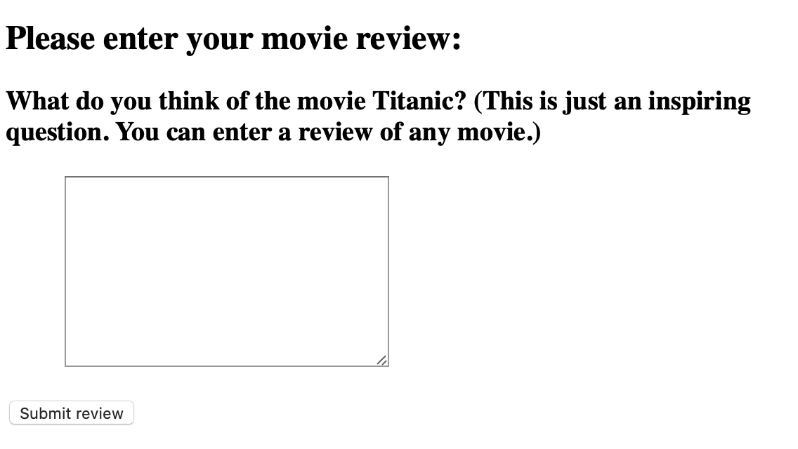

# movie_sentiment_analysis

This is a [web application](http://tz000.pythonanywhere.com) created with Flask that is connected to a pre-trained logistic regression model which classifies the sentiment of a movie review (positive or negative) and can be updated based on user’s feedback.

# Modeling
The data processing and modeling part is in "model_part" folder. [[go]](model_part/create_model.py) The model is trained with stochastic gradient descent so that it can be retrained when getting the user's feedback. The model is then saved as a .pkl file and put in the web application.

# Web part
The web application is in ["web_part" folder](web_part). A SQLite is used to store the the review and feedback (correct classification or wrong classification) to update the model.

# Data 
The data this model is trained on is [Large Movie Review Dataset](https://ai.stanford.edu/~amaas/data/sentiment/). (It is too large, not going to upload)
